# ⚡ Neon Survival Arena

[](https://neon-survival-arena.vercel.app)
[](LICENSE)
[](https://react.dev)
[](tsconfig.json)

> A top-down neon survival shooter for desktop **and** mobile web. Move, auto-fire,
> collect XP, level up, pick upgrades, survive the swarm. There is no ending —
> **the clock is the score.**

**🎮 Play it live: [neon-survival-arena.vercel.app](https://neon-survival-arena.vercel.app)** — works on desktop and phones

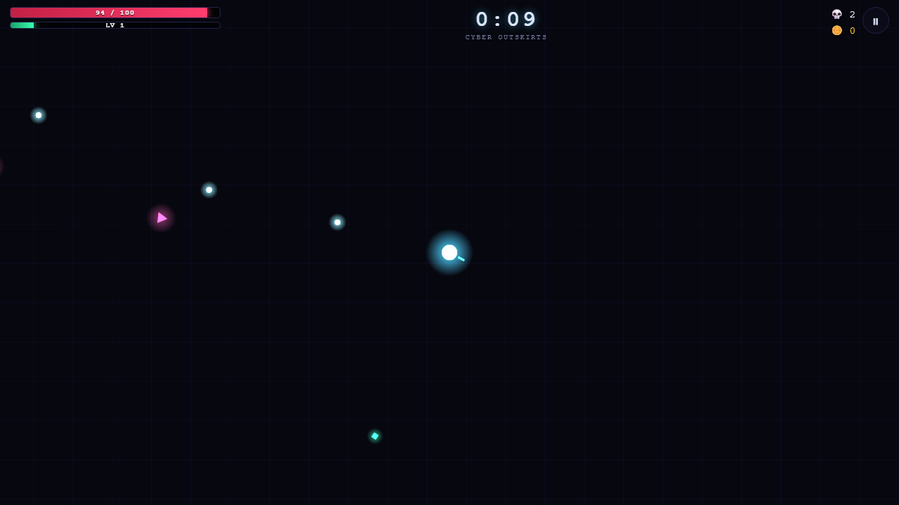

## How it plays

You're a glowing orb in an endless neon arena. Enemies close in from every side;
your weapon fires on its own — your job is to move, aim, and make build decisions:

**Kill → collect XP gems → level up → pick 1 of 3 random upgrades → grow stronger →
enemies scale up → boss every 3 minutes → repeat, harder each cycle.**

Random upgrade choices mean no two runs play the same. *"I survived 18 minutes...
I can beat 20."*

## Features

- **18 stacking upgrades → 4 weapon evolutions** — Fire / Ice / Lightning-chain /
  Explosive / Ricochet bullet mods, Triple Shot, Railgun Pierce, Drone Companions,
  Orbiting Shield, Nova Pulse, Neural Link… max out two synergistic lines and the
  next level-up guarantees a gold **EVOLUTION** card: *Meteor Storm* (explosions
  scorch the ground), *Static Field* (auto arc-storm), *Bullet Hell* (endless
  ricochets), *Orbital Array* (novas fire radial bullet rings)
- **Dash with i-frames** — Space / right-click on desktop, a dedicated DASH button
  on touch. Blink through the swarm, cooldown ring on your orb.
- **Kill-streak combos** — chain kills inside a 2-second window for up to ×3
  XP/coins; taking a hit breaks the streak
- **7 enemy types + elites** — swarming bugs, tanks, ranged snipers, erratic
  flyers, exploding rushers, teleporting ninjas, shield-bearers — and rare
  **elite** variants (swift / regenerating / splitting / vampiric) that drop
  treasure chests with slot-machine upgrade rewards
- **Ground pickups** — health packs, magnet bombs, screen-clearing nukes, and
  10-second overdrive
- **3 bosses on a 3-minute clock, telegraphed** — Giant Robot (rockets + radial
  slam), Cyber Worm (burrows and erupts under you), Alien Queen (minion swarms +
  projectile bursts) — every big attack has a visible wind-up, and each cycle
  they return stronger
- **Cinematic deaths** — slow-mo zoom on the killing blow, then a recap that
  names what killed you, your max combo, and your live global rank
- **Meta progression** — coins persist between runs: 4 characters with different
  starting builds **plus a permanent upgrade shop** (hull, damage, magnet, coin
  gain, head start, speed); local top-10 leaderboard; **24 achievements** with
  in-run toast pops
- **⚡ Daily challenge** — everyone plays the same seeded run with a rotating
  daily modifier (Swarm Day, Glass Cannon, Elite Hour…) on its own global
  leaderboard. One real attempt per day; replays are practice.
- **Global leaderboard** — every finished run is submitted to a public Supabase
  table under your editable "callsign," visible to everyone who plays. No
  accounts, no login — the menu's LEADERBOARD tab has GLOBAL / THIS DEVICE /
  DAILY toggles.
- **All juice, no assets** — every visual is procedural canvas glow (additive
  compositing, particle bursts, screen shake, floating damage numbers). Every
  sound *and* the music score are synthesized live with the Web Audio API —
  zero image/audio files anywhere in the game.
- **5 living environments, each with its own song** — every 60-120s the arena
  transitions to a new biome (Cyber Outskirts → Toxic Wastes → Molten Core →
  Frostbyte Zone → Deep Void → loops), each with its own palette, ambient
  particles (spores, embers, snow, stars), *and* its own key/tempo/instrument
  timbre in the music engine — the score crossfades to match. A banner
  announces each transition.
- **A score that sings** — a 4-bar synthwave progression per environment with
  pulsing sub bass, a filtered arpeggio, four-on-the-floor drums, and a legato
  lead voice with real portamento + vibrato carrying an actual melody.
  Intensity reacts to real danger (swarm density + bosses), kicks into a driving
  boss mode during boss fights, and muffles behind a heartbeat when you're
  nearly dead.
- **Desktop + mobile, properly** — WASD + mouse on PC, dual virtual thumbsticks
  on phones, auto-detected. A visible pause button (not just a keyboard
  shortcut) so touch players can actually pause. Haptic feedback on
  hits/level-ups/boss warnings, a screen wake lock so long runs don't dim the
  phone, a rotate-your-device gate in portrait, larger touch targets, and a
  "reduce effects" toggle for lower-end devices. Installable as a PWA.

## Controls

| | Move | Aim | Fire | Dash | Pause |
|---|---|---|---|---|---|
| **Desktop** | WASD / arrows | mouse | automatic | Space / right-click | P / Esc / pause button |
| **Mobile** | left thumbstick | right thumbstick | automatic | DASH button (bottom-right) | pause button (top-right) |

## Tech stack

- **React 19 + Vite + TypeScript** — menus, HUD, upgrade picker, run recap
- **HTML5 Canvas** — the actual game, driven by a raw `requestAnimationFrame`
  loop inside a React ref. Canvas owns the frame loop for performance; React owns
  everything around it and never touches the hot path.
- **Web Audio API** — procedural synthesis for every sound effect and the music score
- **localStorage** — coins, unlocks, local leaderboard, achievements, callsign
- **Supabase (Postgres)** — the *only* backend piece: one public `scores` table
  behind Row Level Security (anonymous insert + read, nothing else) powers the
  global leaderboard. Everything else in the game is 100% client-side.
- **Vercel** — deploys as a static site, zero server config

## Architecture

```
src/
  App.tsx              — root shell: menu / game / recap routing, save data
  GameScreen.tsx       — mounts the canvas, bridges engine ↔ React overlays
  game/
    loop.ts            — the game loop (rAF), owns the mutable GameState
    render.ts          — canvas renderer (cached glow sprites, additive pass)
    input.ts           — desktop + mobile input adapters
    audio.ts           — Web Audio SFX + the shared music gain bus
    music.ts           — the procedural score: 5 themes, look-ahead scheduler,
                          crossfade transitions, a delay/echo send for Deep Void
    environments.ts    — the 5 biome defs (palette, ambient particles, name)
    haptics.ts         — Vibration API wrapper for hit/level-up/boss feedback
    wakelock.ts        — screen wake lock so long runs don't dim the phone
    leaderboard.ts      — Supabase client: submit + fetch global scores
    storage.ts         — localStorage save/load
    config.ts          — ALL tuning: enemies, bosses, upgrades, difficulty curve
    entities/          — player, enemy AI, boss AI, bullets, gems
    systems/           — spawn director, collision + damage, upgrades,
                          particles, ambient atmosphere
  components/
    OrientationGate.tsx — blocks play with a "rotate your device" prompt in portrait
    HUD.tsx, ...       — HUD (incl. pause button), upgrade cards, menus, pause, game over
public/                — PWA manifest + icons
```

The design rule: **the simulation never allocates React state.** The engine pushes
throttled HUD snapshots and lifecycle events (level-up choices, run stats) out
through callbacks; React pushes commands (chosen upgrade, pause/resume) back in
through a small controls API. That separation is what keeps hundreds of entities +
particles at 60 fps while the UI stays declarative.

Performance notes:
- Glow is pre-rendered radial-gradient sprites composited with `lighter` —
  `ctx.shadowBlur` is 10x too slow for this many entities
- Spatial-hash broad phase for all collision queries (bullets, chains, splash,
  separation) — no O(n²) sweeps
- Entity arrays use swap-remove; particle/text/gem counts are capped

## Difficulty scaling

Spawn interval eases from 1.1s → 0.16s over 13 minutes; enemy HP/speed scale on a
gentle per-minute curve (not a spike); new enemy types unlock at time thresholds;
bosses act as a periodic skill check with an HP multiplier per cycle.

## The 5 environments

Every 60-120 seconds the arena transitions to a new biome — new palette, new
ambient particles, new song. A fade banner announces the change and the music
ducks/swaps/fades back in instead of cutting hard.

| Biome | Mood | Ambient | Key / tempo |
|---|---|---|---|
| Cyber Outskirts | the default neon grid | — | C minor, 96 BPM |
| Toxic Wastes | murky, grimy | drifting spores | A minor, 100 BPM, square-wave arp |
| Molten Core | aggressive, fast | rising embers | F# minor, 128 BPM, all-sawtooth |
| Frostbyte Zone | calm, ethereal | falling snow | B minor, 84 BPM, sine/triangle, sparse drums |
| Deep Void | sparse, spacious | twinkling stars | D minor, 80 BPM, sparse drums + echo send |

Every environment shares the same melodic contour (same scale-degree shape,
transposed) so the themes feel like variations on one motif rather than five
unrelated tracks — while still sounding distinct through key, tempo, and
instrument timbre.

| Toxic Wastes | Molten Core |
|---|---|
| 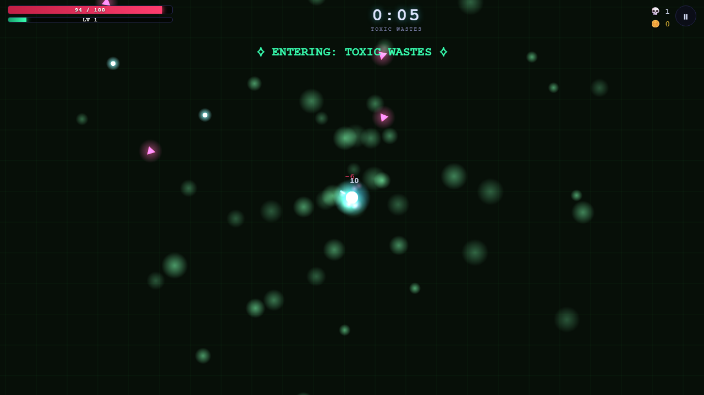 | 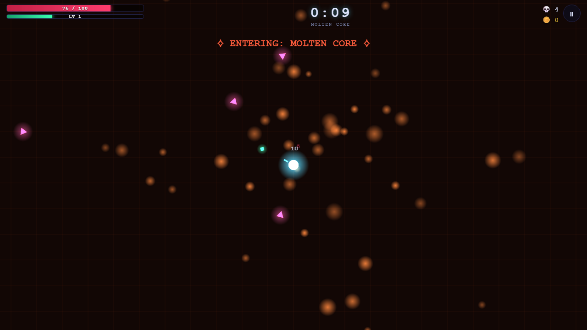 |

| Frostbyte Zone | Deep Void |
|---|---|
| 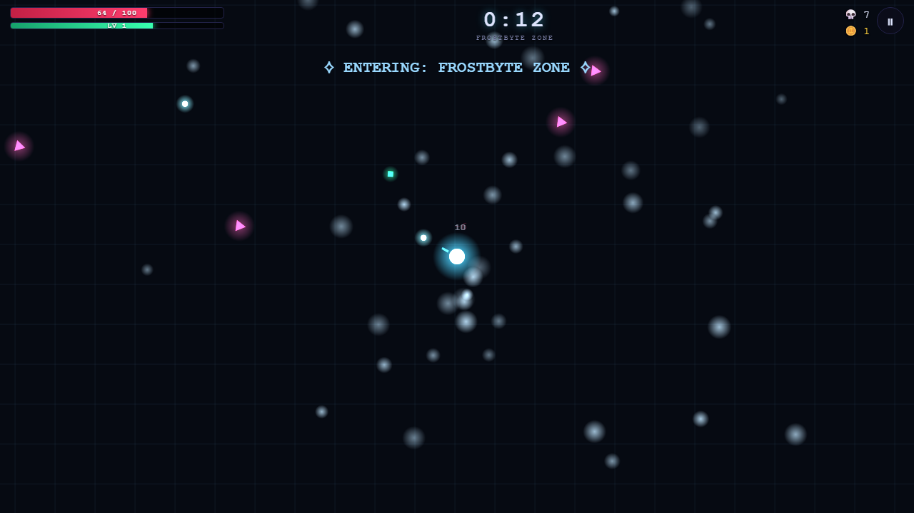 | 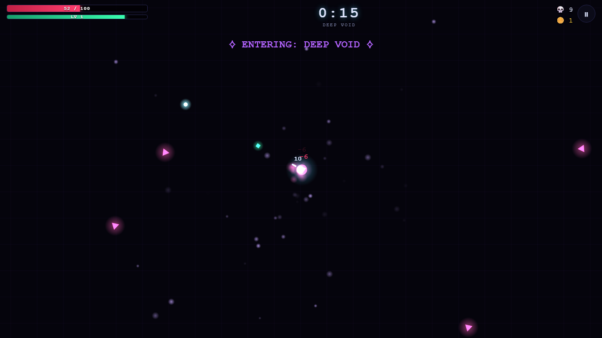 |

## Run it locally

```bash
npm install
npm run dev      # http://localhost:5173
npm run build    # production build → dist/
```

No accounts, and the game is fully playable with zero setup. The **global**
leaderboard needs two env vars (copy `.env.example` → `.env.local` and fill in
a Supabase project URL + anon key); without them the app falls back to the
local-only leaderboard automatically.

## Lessons learned

- **Canvas-in-React works great if you draw a hard line.** One `useEffect` mounts
  the engine, one callback surface crosses the boundary. The moment game state
  leaks into React state, the frame budget is gone.
- **`ctx.shadowBlur` does not survive contact with 200 entities.** Pre-rendered
  gradient sprites + additive compositing give the same neon look ~10x faster.
- **Web Audio needs a rate limiter.** 30 simultaneous hit sounds in one frame is
  just clipping — throttling identical SFX to one per ~60ms *sounds* better.
- **Balance lives in one file on purpose** (`config.ts`) — every playtest tweak
  is a one-line diff.
- **A "singing" synth lead is a persistent voice, not one-shot notes.** Creating
  a fresh oscillator per note kills legato. Keeping one oscillator pair alive
  for the whole run and *gliding* its frequency between notes (`setTargetAtTime`)
  plus a low-depth vibrato LFO summed into the same `AudioParam` is what makes
  it sound sung instead of plinked.
- **RLS is the entire leaderboard backend.** Two Postgres policies (anon insert,
  anon select) on one table replace what would otherwise be an API route + auth
  layer. The client never needs a service key.
- **Environment transitions need a duck, not a hard cut.** Swapping chords/tempo/
  instrument waveforms mid-track instantly is jarring; briefly ducking a
  dedicated gain node, swapping the theme at the quiet point, then fading back
  reads as an intentional musical transition instead of a glitch.
- **Mobile needs its own pause affordance.** The original build only bound
  pause to a keyboard key — meaning touch players had *no way to pause at
  all*. A visible on-screen button is not optional polish on a touch device.
- **`OscillatorNode.type` can change on a running, already-started oscillator**
  without recreating the node — which is what lets the persistent lead voice
  keep its legato glide across an environment change instead of restarting.

## More screenshots

| Main menu | Global + local leaderboard |
|---|---|
| 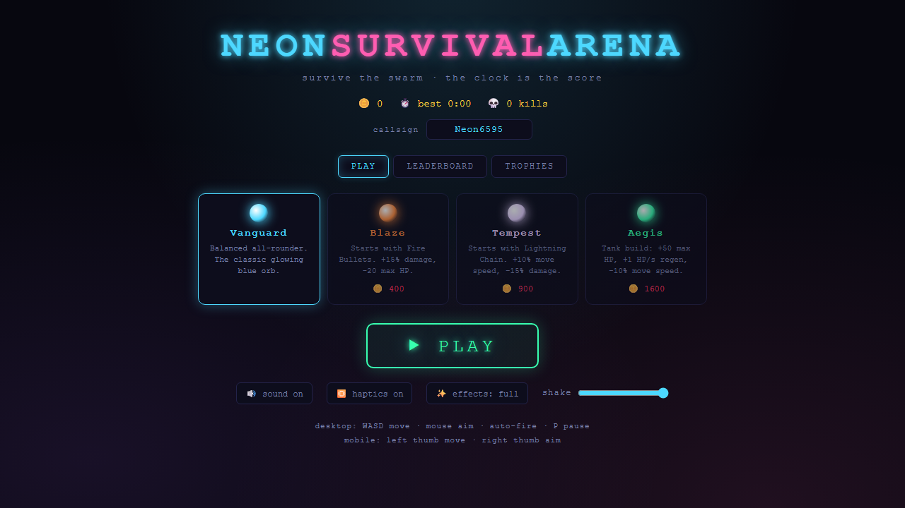 | 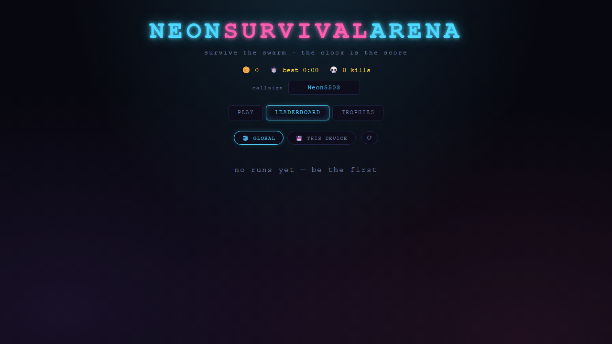 |

| Level up | Run recap |
|---|---|
| 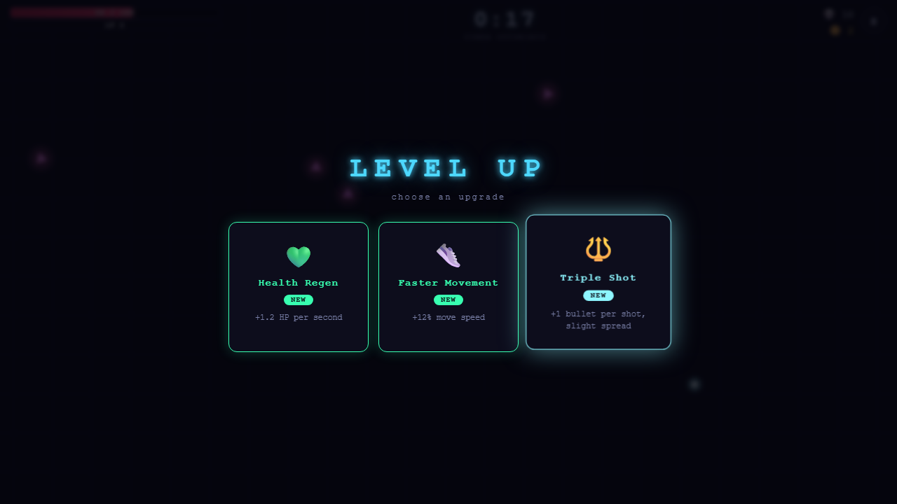 | 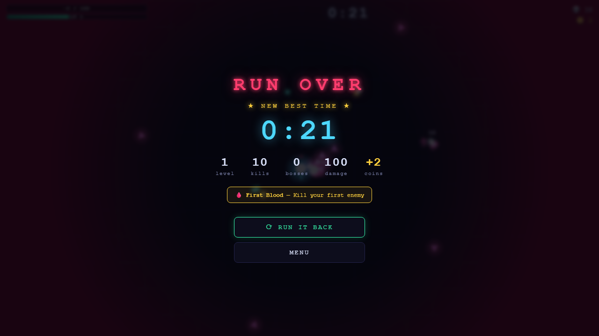 |

### Mobile

| Landscape gameplay (pause button top-right) | Portrait rotate gate |
|---|---|
| 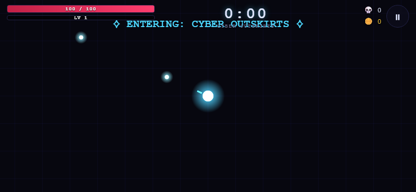 | 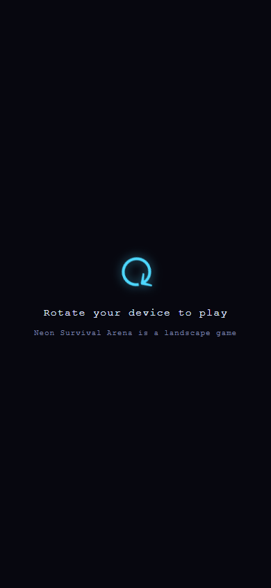 |

## Future improvements

- Colorblind-safe palette option
- Gamepad support
- A music theme for the menu screen (currently silent until you hit Play)
- Country/region flags on the global leaderboard
- Shareable run-recap image cards

## License

[MIT](LICENSE) — do whatever you want with it.
